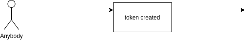

**Summary**

The present specification describes *EIP20* smart
contract that represents an implementation of custom
token that allows:
- simple token transfer
- transfer with allowance

The specification follows _Pruvendo_ six-step 
simplified specification model that ensures
comprehensive and full specification.

**Step I. Scenarios**

The following user scenarions are identified:
- Create new token
- Make a simple tranfer
- Make a transfer with allowance

**Step II. Overall logic**

*Create new token*

Anybody can create a new token with a specific name, 
symbol, decimal units and initial supply, where
initial supply is assigned to the creator.

*Simple transfer*

