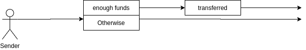
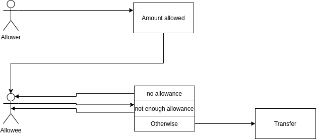
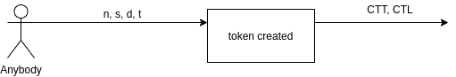
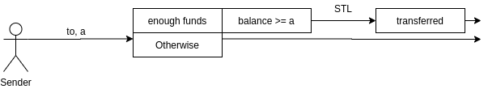
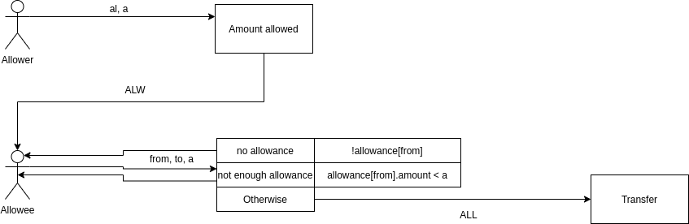

# Summary

The present specification describes *EIP20* smart
contract that represents an implementation of custom
token that allows:
- simple token transfer
- transfer with allowance

The specification follows _Pruvendo_ six-step 
simplified specification model that ensures
comprehensive and full specification.

# Step I. Scenarios

The present section identifies the list of user
scenarios. It is the first step of the suggested
specification approach where the user scenario
(the logically completed set of user actions that
lead to some valuable result) is a central point of
the specification.

The following user scenarions are identified:
- Create new token
- Make a simple tranfer
- Make a transfer with allowance

# Step II. Overall logic

The present step describes the basic workflow for
each scenario, without deep diving into the details.

## Create new token

Anybody can create a new token with a specific name, 
symbol, decimal units and initial supply, where
initial supply is assigned to the creator.

## Simple transfer

Anybody can transfer arbitrary (up to the available)
amount of tokens to any other recipient.

## Allowance

Anybody can allow to spend a specific amount to the
particular allower. The latter can transfer an 
arbitrary amount that does not exceed the allowance to
any recepient.

# Steps III-V. Detailed logic and invariants

According to the _Pruvendo_ specification approach:
- Step III describes the details of the outcome
- Step IV describes the details of the input
- Step V describes the details of the body

At each step the data types, their local invariants as
well as global invariants are gradually introduced.
However, taking into account the simplicity of all
the considered scenarios, the steps are defined 
together.

## Types

This section defines data types and type (local)
invariants. The special type _Ledger_ defines the
whole system.

| Token |||
| --- | --- | --- |
| name | String | Textual token name |
| symbol | String | Token symbol, such as USDT |
| decimals | Number | Decimal digits for "minor" currency |
| total | Number | Total supply for the token |
| c | String -> String -> Number -> Number -> Token | Token constructor
| _Local invariants_ |||
| CTT.1 | decimals &ge; 0 | Decimals are never negative |
| CTT.2 | total &ge; 0 | Total is never negative |
| CTT.3 | c(n, s, d, t).name = n &and; c(n, s, d, t).symbol = s &and; c(n, s, d, t).decimals = d &and; c(n, s, d, t).total = t | Token fields are initialized by the corresponding constructor parameteres |

| Allowance |||
| --- | --- | --- |
| allowee | Address | Address of the allowee |
| amount | Number | Allowed amount |
| c | Address -> Number -> Allowance | Allowance constructor |
| transfer | Allowance -> Number -> Allowance | Transfer amount by allowance |
| _Local invariants_ |||
| ALA.1 | amount &gt; 0 | Allowance is never negative |
| ALA.2 | c(addr, a).allowee = addr &and; c(addr, a).amount = a | Alloance fields are initialized by the corresponding constructor parameteres |
| ALA.3 | ok(transfer(a)) &harr; a &le; amount | Transfer is possible when and only when the allowance is not smaller than the required amount |
| ALA.4 | ok(transfer(a)) &rarr; all.transfer(a) = all[amount -= a] | As a result of transfer allowed amount is decreased by the corresponding number |

| Wallet |||
| --- | --- | --- |
| user | Address | Address of the wallet's owner |
| balance | Number | Wallet balance |
| allowances | [Allowance] | Allowances given |
| approve | Wallet -> Allowance -> Wallet | Approve allowance |
| _Local invariants_ |||
| CTW.1 | balance &ge; 0 | Balance is never negative |
| ALW.1 | a1, a2 &in; allowances &rarr; a1.allowee = a2.allowee &rarr; a1 = a2 | Only one allowance per the pair of allower and allowee |
| ALW.2 | all &in; approve(all).allowances | Approved allowance is added to allowances |
| ALW.3 | &exist; a0: w.approve(all) = w[allowances = a0] | No fields but _allowances_ is altered  by _approve_ |
| ALW.4 | a &ne; all &and; a &in; allowances &harr; a &ne; all &and; a &in; approve(all).allowances | Not related allowances are not touched by the approval |
 
| Ledger |||
| --- | --- | --- |
| token | Token | Token of the contract |
| wallets | [Wallet] | The registered wallets |
| c | String -> String -> Number -> Number -> Ledger | Ledger Initialization |
| transfer | Ledger -> Address -> Number -> Ledger | Transfer amount from one account to another |
| transferFrom | Ledger -> Address -> Address -> Number -> Ledger | Transfer from one account to another using allowance |
| _Local invariants_ |||
| CTL.1 | transfer( \_ )\.token = token &and; transferFrom( \_ )\.token = token | Token is not changeable after the construction |
| CTL.2 | c(n, s, d, t).token = Token.c(n, s, d, t) | _token_ of the _Ledger_ is initialized by the corresponding constructor parameteres |
| STL.1 | c( \_, t )\.wallets.size = 1 &and; ( &exist; w: w &in; c( \_, t )\.wallets &and; w.user = actor(c) &and; w.balance = t &and; w.allowances = [] ) | As a result of construction there is a single wallet owned by the initializing actor, having the whole amount of tokens and no allowance |
| STL.2 | $`\sum_{w \in wallets}w.map(balance) = total `$ | The sum of all the balances always equals to _total_ |
| STL.3 | w1, w2 &in; wallets &rarr; w1.user = w2.user &rarr; w1 = w2 | Only one wallet per user is allowed |
| STL.4 | ok(transfer(to, a)) &harr; (&exist; w: w &in; wallets &and; w.user = actor(transfer(to, a)) &and; w.balance &ge; a) | _transfer_ is possible when and only when the sending wallet (determined by the sending actor) exists and has a balance excceding the required amount |
| STL.5 | ok(transfer( _ )) &rarr; &exist; w0: l.transfer( _ ) = l [wallets = w0] | As a result of _transfer_ only _wallets_ are modified |
| STL.6 | ok(transfer(to, a))  &rarr; w.user &ne; to &rarr; w.user &ne; actor(transfer(to, a)) &rarr; (w &in; wallets &harr; w &in; transfer(to, a).wallets) | As a result of _transfer_ all the non-participating wallets are not changed |
| STL.7 | ok(transfer(to, a)) &rarr; w &in; wallets &rarr; w.user = actor(transfer(to, a)) &rarr; (&exist; w1: w1 &in; transfer(to, a).wallets &and; w1 = w[balance -= a]) | As a result of _transfer_ balance of sender is decreased by the required amount |
| STL.8 | ok(transfer(to, a)) &rarr; w &in; wallets &rarr; w.user = to &rarr; (&exist; w1: w1 &in; transfer(to, a).wallets &and; w1 = w[balance += a]) | As a result of _transfer_ balance of receiver is increased by the required amount |
| ALL.1 | ok(transferFrom(from, to, a)) &harr; (&exist; al, f : f &in; wallets &and; f.user = from &and; f.balance &ge; a &and; al &in; f.allowances &and; al.allowee = actor(transferFrom(from, to, a)) &and; al.amount &ge; a) | _transferFrom_ is successful when and only when _from_ wallet has enough balance as well as enough allowance granted to the sending actor |
| ALL.2 | ok(transferFrom( \_ )) &rarr; (&exist; w0: l.transferFrom\( \_ \) = l[wallets = w0] | Only _wallets_ are modified at _transferFrom_ |
| ALL.3 | ok(transferFrom(from, to, a)) &rarr; w.user &ne; from &rarr; w.user &rarr; w.user &ne; to &rarr; (w &in; wallets &harr; w &in; transferFrom(from, to, a).wallets) | All the wallets differ from _to_ and _from_ are not changed |
| ALL.4 | ok(transferFrom(from, to, a)) &rarr; w &in; wallets &rarr; w.user = from &rarr; (&exist; w0, al0: w0 &in; transferFrom(from, to, a) &and; w0 = w[balance -= a, allowances = a0] &and; (&forall; s: s.allowee &ne; actor(transferFrom(from, to, a)) &rarr; (s &in; w.allowances &harr; s &in; al0)) &and; (&exist; all0,all1: all0 &in; w.allowances &and; all1 &in; al0 &and; all0.allowee = actor(transferFrom(from, to, a)) &and; all1 = all0.transfer(a))) | In case of successful _transferFrom_ the balance of _from_ is decreased by the required amount, together with the corresponsing allowance. All the non-participating elements are not changed |
| ALL.5 | ok(transferFfrom(from, to, a)) &rarr; w &in; wallets &rarr; w.user = to &rarr; (&exist; w1: w1 &in; transferFrom(from, to, a).wallets &and; w1 = w[balance += a]) | As a result of _transferFrom_ balance of receiver is increased by the required amount |

## Charts

As a result of the steps III-V the original charts
are modified in the following way.

### Create new token

### Simple transfer

### Allowance

# Step VI. Mapping to the implementation

## Step VI.I. Type mapping

The present section represent rough correspondence
between high- and low-level types and functions.
It is used as an auxillary tool for further invariant
mapping.

### Token

| High-level | Low-level |
| --- | --- |
| Token | EIP20 |
| name | name |
| symbol | symbols |
| decimals | decimals |
| total | totalSupply |
| c | constructor |

### Allowance

| High-level | Low-level |
| --- | --- |
| Allowance | allowed.value |
| allowee | value.key |
| amount | value.value |
| c | allowed[msg.sender][_spender] = _value |
| transfer | allowed[_from][msg.sender] -= _value |

### Wallet

| High-level | Low-level |
| --- | --- |
| Wallet | balances(key-value) |
| user | key |
| balance | value |
| allowances | allowed(key = balances.key) |
| approve | approve |

### Ledger

| High-level | Low-level |
| --- | --- |
| Ledger | EIP20 |
| token | (name, symbol, decimals, tokenSupply) |
| wallets | balances |
| c | constructor |
| transfer | transfer |
| transferFrom | transferFrom |

## Step VI.II. Mapping of the invariants

It is the last section of the document and the
starting point for the verifiers. They
are expected to take the definitions below and
convert them into _Coq_ predicates to be proven
against the implementation.

### Token

| Index | Definition |
| --- | --- |
| CTT.1 | decimals &ge; 0 |
| CTT.2 | totalSupply &ge; 0 |
| CTT.3 | constructor(n, s, d, t).name = n &and; c(n, s, d, t).symbol = s &and; c(n, s, d, t).decimals = d &and; c(n, s, d, t).totalSupply = t |

### Allowance

| Index | Definition |
| --- | --- |
| ALA.1 | allowed.value.value &ge; 0 |
| ~~ALA.2~~ | ~~Not related to the implementation. Removed~~ |
| ~~ALA.3~~ | ~~Superceded by latter properties. Removed~~ |
| ~~ALA.4~~ | ~~Superceded by latter properties. Removed~~ |

### Wallet

| Index | Definition |
| --- | --- |
| CTW.1 | balances.value &ge; 0 |
| ~~ALW.1~~ | ~~Automatically ensured by mapping. Removed~~ |
| ALW.2 | allowed[msg.sender][s]{approve(s,v)} = v |
| ALW.3 | &exist; a0: EIP20{approve( _ )} = EIP20[allowed = a0] |
| ALW.4 | s0 &ne; s &or; k &ne; msg.sender &rarr; allowed[k][s0]{approve(s,v)} = allowed[k][s0] |

### Ledger

| Index | Definition |
| --- | --- |
| CTL.1 | name{transfer} = name &and; symbol{transfer} = symbol &and; decimals{transfer} = decimals &and; totalSupply{transfer} = totalSupply &and; name{transferFrom} = name &and; symbol{transferFrom} = symbol &and; decimals{transferFrom} = decimals &and; totalSupply{transferFrom} = totalSupply |
| ~~CTL.2~~ | ~~Duplicate of CTT.3. Removed~~ |
| STL.1 | balances{constructor}.size = 1 &and; balances{constructor(n, s, d, t)}[msg.sender] = t &and; allowed{constructor} = [] |
| STL.2 | $`\sum_{b \in balances}b.map(value) = totalSupply`$ |
| ~~STL.3~~ | ~~Achieved automatically due to hashmap usage. Removed~~ |
| STL.4 | ok(transfer(to, a)) &harr; balances[msg.sender] &ge; a |
| STL.5 | ok(transfer(to, a)) &rarr; &exist; w0 : EIP{transfer} = EIP[balances = w0] |
| STL.6 | ok(transfer(to, a)) &rarr; w &ne; msg.sender &rarr; w &ne; to &rarr; balances[w]{transfer} = balances[w] |
| STL.7 | ok(transfer(to, a)) &rarr; balances[msg.sender]{transfer} -= a |
| ~~STL.8~~ | ~~A direct consequence of STL.2, STL.6 and STL.7. Removed~~ |
| ALL.1 | ok(transferFrom(from, to, a)) &harr; balances[from] &ge; a &and; allowed[from][msg.sender] &ge; a |
| ALL.2 | ok(transferFrom(from, to, a)) &rarr; (&exist; b,al : EIP20{transferFrom} = EIP20[balances = b, allowed = al]) |
| ALL.3 | ok(transferFrom(from, to, a)) &rarr; w &ne; from &rarr; w &ne; to &rarr; balances[w]{transferFrom} = balances[w] |
| ALL.4a | ok(transferFrom(from, to, a)) &rarr; w &ne; msg.sender &rarr; allowed[w]{transferFrom} = allowed[w] |
| ALL.4b | ok(transferFrom(from, to, a)) &rarr; w = msg.sender &rarr; allowed[w]{transferFrom} = allowed[w] - a |
| ALL.4c | ok(transferFrom(from, to, a)) &rarr;  balances[from]{transferFrom} = balances[from] - a |
| ~~ALL.5~~ | ~~A direct consequence of STL.2, ALL.3, ALL.4c. Removed~~ |